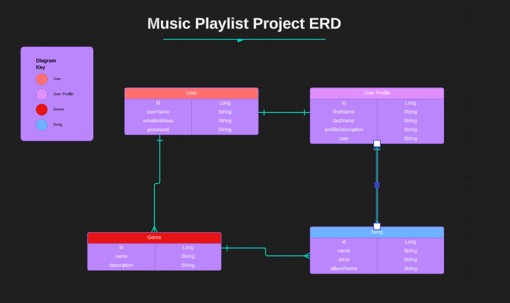

# Music Playlist

A RestAPI designed allow users to search for different music genres  of music and add them to a saved list of favorites.

## Technologies Used

* Java 17
* Maven
* Spring Boot
* Spring Data (JPA)
* Spring Security
* JSON Web Tokens
* H2 Database
* Postman

### General Approach

I started off by creating my user stories and acceptance criteria. This helped me visualize my end goals and outline what I wanted to achieve with this project. I also created a spreadsheet of all my HTTP methods and endpoints to keep track of which methods were supposed to hit which endpoint.

Finally, I created an ERD (entity relationship diagram) to plan my different models and their relevant attributes. This helped me to visualize their relationships to one another and plan out how I was going to link the corresponding tables in the database.

### Major Hurdles

At first, I struggled with getting my POST requests to work because Postman kept giving me a 403 Forbidden error. I was able to remove a line of code in the user authorizations that fixed this error.

I tried to add an option to search for, save, update, and delete songs as well but wasn't able to get the CRUD methods working for that endpoint. This is something I plan on fixing in the near future.

### Links
* User Stories - https://docs.google.com/document/d/16ek8FE4TUzlVReWvnzi49K1mPvhZvCIPBhUX0MJwF1U/edit?usp=sharing

* HTTP requests/endpoints spreadsheet - https://docs.google.com/spreadsheets/d/1fRC1rdl435kJwRgIQfqUqSPaAvpXt2WSC11jCMXAtT8/edit?usp=sharing

* ERD (entity relationship diagram) - https://lucid.app/lucidchart/25ce1cef-2bbe-49c0-a567-cecbd7df60e2/edit?viewport_loc=664%2C250%2C756%2C423%2C0_0&invitationId=inv_0cab7add-6d52-48b0-9665-1d940a3d0319

## Special Thanks

* Suresh Sigera - my instructor who not only taught me all the concepts used in this project, but also wrote the code I used in the security package handling authorization. GitHub Link: https://github.com/sureshmelvinsigera

* Elizabeth Yang - my partner in pair programming during class, who helped me to refactor CRUD methods relevant to the user, which I used as a reference when writing the CRUD methods for this project. GitHub Link: https://github.com/lizabawa

## Author

:woman_technologist: Erica Ayala

* [LinkedIn](https://www.linkedin.com/in/ayalavirtual)

* [GitHub](https://www.github.com/AyalaVirtual) 

